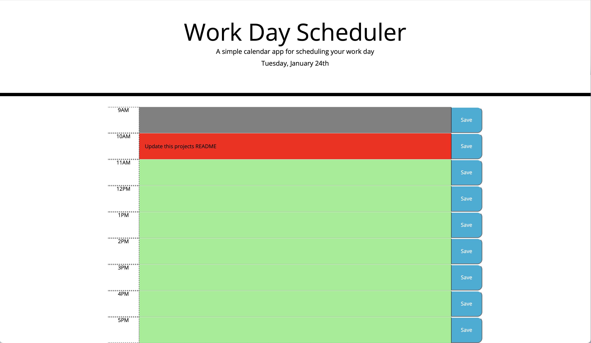
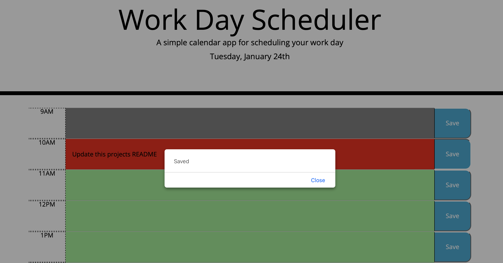

# Work Day Scheduler

## Description

Simple Work Day Scheduling application that allows a user to save events for each hour of the work day.

All notes that the user inputs are stored in browser memory after clicking the save button to the right of each field. When user closes and re-opens the window, program checks if there are any values currently stored in memory and if so it populates the related value fields.

When user clicks 'Save' an alert pops up on screen to inform the user that their note has been saved.

## Installation

N/A

## Credits

N/A

## License

Please refer to the LICENSE in the repo.

## Technologies used

